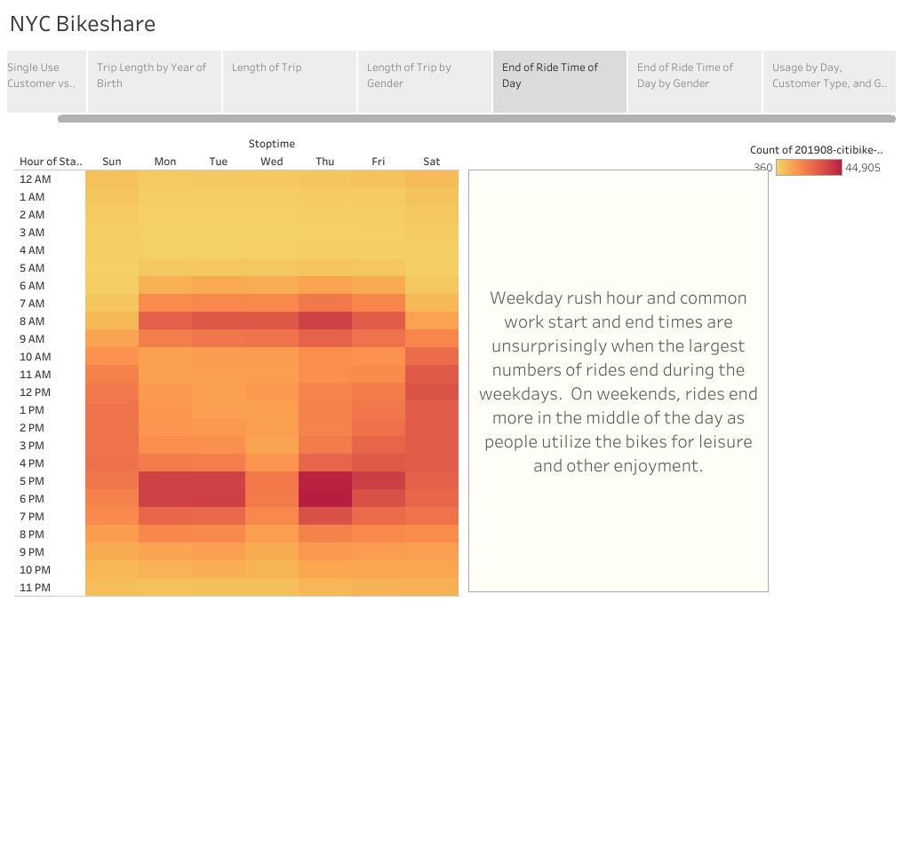

# NY CitiBike with Tableau

## Overview of The Analysis

## Results

A fully interractive dashboard may be found .
[link to dashboard](https://public.tableau.com/shared/QKTF6SRWH?:display_count=n&:origin=viz_share_link "here.")  

### Single Use Customer vs. Program Subscribers  

We see well over 75% of all users are subscribers.  This would indicate a consistent revenue stream from local users rather than one-off tourist or "try it out" usage.  

### Trip Length by Year of Birth  
  
Users may have input erroneous data for year of birth (it is unlikely that someone born in 1891 rode a bike through New York City for 45 mintues).  More telling is the trip length amongst late Millenial and Gen Z users.  An analysis of average birth year of Des Moines residents could predict the relative success of the program based on age and length of trip.  

### Length of Trip  
 
Most rides last less than twenty minutes.  Considering this is New York City data, we should consider the average time it may takes to bike between locations in Des Moines through an analysis of Google Maps bike time data between residential areas and commercial areas around Des Moines.  

### Length of Trip by Gender  
  
More male than female users are shown to utilize the bikesharing program.  Marketing should consider targeting the female population of Des Moines to increase revenue and utilization.  

### End of Ride Time of Day  
  
Weekday rush hour and common work start and end times are unsurprisingly when the largest numbers of rides end during the weekdays.  On weekends, rides end more in the middle of the day as people utilize the bikes for leisure and other enjoyment.  

### End of Ride Time of Day by Gender  
  
Gender appears to have little impact on when a ride may end.  Lighter hues and values for the female heatmap simply indicate the relatively lower number of total female users.  

### Usage by Day, Customer Type, and Gender  
  
Thursdays tend to be the busiest days, and again, men seem to use the program more.  Single-use customers, as expected seem to utilize more on the weekends, indicating tourist usage.  Marketing should focus on consistent revenue-stream subscriber models geared towards women to both increase user base and capitalize on the heavier usage subscirber model.  

Note:  Repair costs associated with more usage by subscribers should be considered when pricing subscription pricing.  
## Summary

Discovered code from
http://tableauworkaround.blogspot.com/2016/06/hhmmss-to-seconds-in-tableau.html

https://public.tableau.com/shared/QKTF6SRWH?:display_count=n&:origin=viz_share_link
